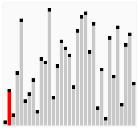

  # 排序算法：
### 排序算法简介(C语言实现)
我们通常所说的排序算法往往指的是`内部排序算法`，即数据记录在内存中进行排序。

排序算法大体分为两种：

    一种是比较排序，时间复杂度为O(nlogn)~O(n^2)，主要有：冒泡排序，选择排序，插入排序，归并排序，堆排序，快速排序等。
    另一种是非比较排序法，时间复杂度可以达到O(n)，主要有：计数排序，基数排序，桶排序等。

  
 排序算法稳定性的简单形式化定义为：如果Ai = Aj，排序前Ai在Aj之前，排序后Ai还在Aj之前，则称这种算法是稳定的。即保证排序前后两个相等的数的相对顺序不变。
## 比较排序
#### 冒泡排序(Bubble Sort)
+ 原理：
  + step1：比较相邻的元素，如果前一个比后一个大，就把他们两个调换位置。
  + step2：对每一对相邻元素执行step1，从开始第一对到最后一对，，完成之后，最后元素即为最大元素。
  + step3：针对所有的元素重复以上操作，除了最后一个。
  + step4：持续每次对越来越少的元素重复以上的步骤，直到没有任何一个数字需要比较。
+ 代码实现：
```C
//最差时间复杂度--------O(n^2)
//最优时间复杂度--------如果在内部循环第一次运行时，使用一个旗标来表示有无交换的可能，可以把最优时间复杂度降低到O(n)
//平均时间复杂度--------O(n^2)
//稳定性---------------稳定
void BubbleSort(int A[],int n){
   int temp;
   for(int j = 0; j < n-1; j++){
     for(int i = 0; i < n-1-j; i++){
       if(A[i]>A[i+1]){
         temp = A[i];
         A[i] = A[i+1];
         A[i+1] = temp;
       }
     }
   }
}
```
+ 实现过程：

  

  

#### 冒泡排序的改进：鸡尾酒排序
+ 原理：

  鸡尾酒排序，也叫定向冒泡排序，是冒泡排序的一种改进。此算法与冒泡排序的不同之处在于`从低到高然后从高到低`，而冒泡排序仅从低到高去比较序列里的每个元素，这种方法可以得到比冒泡排序稍微好一点的效能。
+ 代码实现：
```C
//稳定性---------稳定
void CocktailSort(int A[],int n){
    int left = 0;     //初始化边界
    int right = n - 1;
    int temp;
    while (left < right) {
      //前半轮，将最大元素放到最后面
      for(int i = left; i < right; i++){
        if(A[i]<A[i+1]){
          temp = A[i];
          A[i] = A[i+1];
          A[i+1] = temp;
        }
      }
      right--;
      //后半轮，将最小元素放到前面
      for(int i = right; i > left; i--){
        if(A[i-1]<A[i]){
          temp = A[i-1];
          A[i-1] = A[i];
          A[i] = temp;
        }
      }
      left++;
    }
}
```
+ 实现过程：

  

#### 选择排序(Selection Sort)
+ 原理：
  + step1：初始时在在序列中找到最小（大）元素，放到序列的起始位置作为已排序序列；
  + step2：从剩余未排序的序列中继续寻找最小（大）的元素，放到已排序序列的末尾。以此类推，直到所有元素均排序完毕。
+ 代码实现：
```C
void SelectionSort(int A[],int n){
    for(int i = 0; i < n-1; i++){
      //i为已排序序列的末尾
      int k = i;
      int temp;
      //未排序序列
      for(int j = i+1; j < n; j++){
        if(A[j] < A[k]){
          k = j;        //找出未排序序列中的最小值
        }
      }
      if(k != i){
        //放到已排序序列的末尾，该操作可能会把稳定性打乱，所以选择排序是不稳定的算法
        temp = A[k];
        A[k] = A[i];
        A[i] = temp;
      }
    }
}
```
+ 实现过程：

  

  使用选择排序为一列数字进行排序的宏观过程
  

#### 插入排序(Insertion Sort)
+ 原理：
  + step1：从第一个元素开始，该元素可以被认为已经排序
  + step2：取出下一个元素，在已排序的元素序列中从后向前扫描。
  + step3：若遍历到的已排序的元素大于新元素，该元素(已排序)就移到下一个位置。
  + step4：重复step3，直到找到已排序的元素小于或者等于新元素的位置，将新元素插入到该位置。
  + step5：重复step2~5.
+ 代码实现：
```C
void InsertionSort(int A[],int n){
    for(int i = 1; i < n; i++){   //类似抓扑克牌排序
      int get = A[i];   //右手抓到一张扑克牌
      int j = i - 1;    //左手上的扑克牌总是排序好的
      while(j >= 0 && A[j] > get){
        A[j+1] = A[j];    //如果左手的牌比抓到的牌大，就将其右移
        j--;
      }
      A[j+1] = get;   //直到左手的牌比抓到的牌小（或者二者相等），将抓到的牌插入到该手牌右边（稳定的）
  }
}
```
+ 实现过程：

  

  使用插入排序为一列数字进行排序的宏观过程：
  

  插入排序不适合数据量较大的排序应用，用于少量元素的排序。

#### 插入排序的改进：二分插入排序
+ 原理：

  对于插入排序，如果比较操作的代价比交换操作大的话，可以采用`二分查找法`来减少比较操作的次数，称为二分插入排序。
+ 代码实现：
```C
//稳定
void InsertionSortDichotomy(int A[],int n){
    for(int i = 1; i < n; i++){
      int get = A[i];
      //左手上的牌左右边界进行初始化
      int left = 0;       
      int right = i - 1;
      //采用二分法重新定位新牌的位置
      while(left <= right){
        int mid = (left + right)/2;
        if(A[mid] > get){
          right = mid - 1;
        }else{
          left = mid + 1;
        }
      }
      //将欲插入新牌位置右边的牌整体向右移动一个单位
      for(int j = i - 1; j >= left; j--){
        A[j+1] = A[j];
      }
      //将抓到的牌插入手牌中
      A[left] = get;
    }
}
```
+ 当n比较大时，二分插入排序的比较次数比直接插入排序的情况要好的多，但比直接插入排序的最好情况要差，所以当元素初始序列已经接近升序时，直接插入排序比二分插入排序比较次数少，二分插入排序元素移动次数与直接插入排序相同，依赖于元素初始序列。

#### 插入排序的更高效改进：希尔排序(Shell Sort)
+ 原理：
  + 也叫`递减增量排序`，是插入排序的一种更高效的改进版本。希尔排序是`不稳定`的排序算法。
  + 希尔排序基于插入排序的以下两点性质做出改进：
    + 插入排序在对几乎已经排好序的数据操作时，效率高，即可以达到线性排序的效率
    + 但插入排序一般来说是低效的，因为插入排序每次只能将数据移动一位

    希尔排序通过将比较的全部元素分为几个区域来提升插入排序的性能。这样可以让一个元素可以一次性地朝最终位置前进一大步。然后算法再取越来越小的步长进行排序，算法的最后一步就是普通的插入排序，但是到了这步，需排序的数据几乎是已排好的了（此时插入排序较快）。
+ 代码实现：
```C
void ShellSort(int A[],int n){
    int h = 0;
    //生成初始增量
    while(h <= n){
      h = 3 * h + 1;
    }
    while(h >= 1){
      for(int i = h; i < n; i++){
        int j = i - h;
        int get = A[i];
        while(j >= 0 && A[j] > get){
          A[j+h] = A[j];
          j = j - h;
        }
        A[j+h] = get;
    }
    h = (h - 1)/3;    //递减增量
  }
}
```
+ 实现过程：

  

  希尔排序是不稳定的排序算法，虽然一次插入排序是稳定的，不会改变相同元素的相对顺序，但在不同的插入排序过程中，相同的元素可能在各自的插入排序中移动，最后其稳定性就会被打乱

#### 快速排序(Quick Sort)
+ 原理：
  + step1：从序列中挑出一个元素，作为"基准"(pivot).
  + step2：把所有比基准值小的元素放在基准前面，所有比基准值大的元素放在基准的后面（相同的数可以到任一边），这个称为分区(partition)操作
  + step3：对每个分区递归地进行步骤1~2，递归的结束条件是序列的大小是0或1，这时整体已经被排好序了
+ 代码实现：
```C
void Swap(int A[], int i, int j)
{
    int temp = A[i];
    A[i] = A[j];
    A[j] = temp;
}
int Partition(int A[], int left, int right)  // 划分函数
{
    int pivot = A[right];             // 这里每次都选择最后一个元素作为基准
    int tail = left - 1;                // tail为小于基准的子数组最后一个元素的索引
    for (int i = left; i < right; i++)  // 遍历基准以外的其他元素
    {
        if (A[i] <= pivot)              // 把小于等于基准的元素放到前一个子数组末尾
        {
            Swap(A, ++tail, i);
        }
    }
    Swap(A, tail + 1, right);           // 最后把基准放到前一个子数组的后边，剩下的子数组既是大于基准的子数组
                                        // 该操作很有可能把后面元素的稳定性打乱，所以快速排序是不稳定的排序算法
    return tail + 1;                    // 返回基准的索引
}
void QuickSort(int A[], int left, int right)
{
    if (left >= right)
        return;
    int pivot_index = Partition(A, left, right); // 基准的索引
    QuickSort(A, left, pivot_index - 1);
    QuickSort(A, pivot_index + 1, right);
}
```
```Java
//Java代码
void sort(int[] a,int left,int right){
        if (left < right){
            int i = left;
            int j = right;
            int key = a[i];
            while(i < j){
                while(i < j && a[j] >= key){
                    j--;
                }
                a[i] = a[j];
                while(i < j && a[i] <= key){
                    i++;
                }
                a[j] = a[i];
            }
            a[i] = key;
            sort(a,left,i - 1);
            sort(a,i+1,right);
        }
    }
```
+ 实现过程：

  

  快速排序是不稳定的排序算法，不稳定发生在基准元素与A[tail+1]交换的时刻。

#### 归并排序(Merge Sort)
+ 原理：
归并排序的实现分为递归实现和非递归实现。归并排序算法主要依赖归并(Merge)操作，归并操作指的是将两个已经排序的序列合并成一个序列的操作，归并操作如下：
  + step1：申请空间，使其大小为两个已排序序列之和，该空间用来存放合并后的序列。
  + step2：设定两个指针，最初位置分别为两个已排序序列的起始位置。
  + step3：比较两个指针所指向的元素，选择相对小元素放到合并空间，并移动指针到下一位置
  + step4：重复step3直到某一指针达到序列尾
  + step5：将另一序列剩下的所有元素直接复制到合并序列尾
+ 代码实现：
  + 递归实现：
  ```C
  // 最差时间复杂度 ---- O(nlogn)
  // 最优时间复杂度 ---- O(nlogn)
  // 平均时间复杂度 ---- O(nlogn)
  // 所需辅助空间 ------ O(n)
  // 稳定性 ------------ 稳定
  void MergeSortRecursion(int A[],int left,int right){
      if(left == right){
        return;
      }
  }
  ```

#### 堆排序
